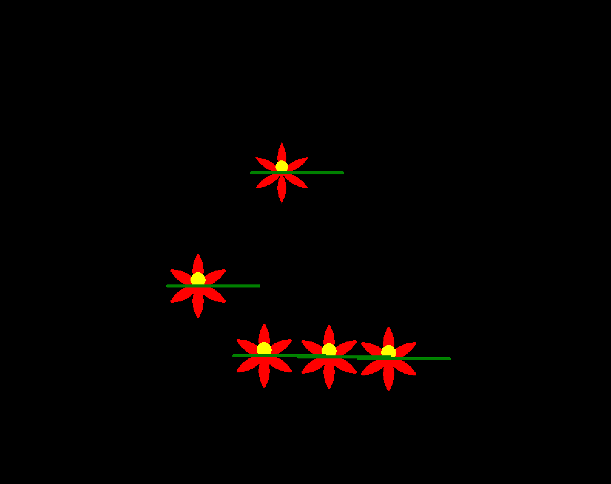

# PyRoses
This was purely for "fun"

I came back too this and asked ChatGPT 3.5 to make the same thing.

My prompt was: "Write me code for python turtle that creates red roses with green stems on a black background" 

I was just curious how well it could perform. I think I did better but that might be bias. I am surprised that it was able to make a flower though.
 
 
 
My Rose:

AI Rose:

